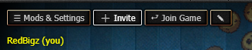

# Macadamia

Macadamia is a custom mod loader for Cookie Clicker which allows players to play online, with dedicated mod APIs to communicate over the Internet.

## Setup
### Prebuilt (I want little hassle)
Head over to the [releases](https://git.redbigz.com/red/macadamia/releases) page to download the latest version of Macadamia.

### Compiled (I want the bleeding edge)
Run these commands in order:

*Windows (posh)*
```powershell
git clone https://git.redbigz.com/red/macadamia.git
cd macadamia

npm install # Installs related NPM packages, must have node installed
npm run build # Builds macadamia to .\out\macadamia.js
```

*Mac/Linux (bash)*
```bash
git clone https://git.redbigz.com/red/macadamia.git
cd macadamia

npm install # Installs related NPM packages, must have node installed
npm run buildLinux # Builds macadamia to ./out/macadamia.js
```

## Usage
### Multiplayer
**⚠ WARNING: If you don't have streamer mode enabled, people may be able to snipe your Peer ID, as the ID will persist across sessions.** With your Peer ID, people can:
- Find your IP address
- Wreak havoc on your save file
- Possibly run a DoS attack on your internet connection

#### Joining a Game


The host must press the invite button, copy their Peer ID, and send it to the joining player.
The joining player will then be able to press the "Join" button, and start playing after inputting the host's Peer ID.

## Basic Docs
There isn't any documentation available yet, but here is a basic mod sample you can lean off of for your mod:

```ts
class MyMod extends Macadamia.Mod {
    async hookBuilder() {
        // Hooks here (example)
        this.hooks
            .hook("vanilla/logic")
            .subscribe(() => this.onLogic);

        // Raisins here (example)
        Game.Prompt = this.createRaisin(Game.Prompt) // createRaisin is used because Raisin can't be disabled. If a mod is disabled, all raisins made via createRaisin will be disabled.
            .insert(0, (content) /* access local vars there */ => {
                // you can manipulate anything here
                content += "<br>Hello World from MyMod!";
            })
            .compile();
    }

    onLogic() {
        // Logic here (from hookBuilder)
    }

    async rpcBuilder() {
        // RPCs here (example)

        // RPC
        this.example = this.createRPC("example");
        this.example.setCallback((payload: { /* payload types here (TS) */ }) => {
            // this essentially becomes a function
        });
    }

    async awake() {
        // When your mod is enabled this is called.

        this.logger.log("Hello World");

        this.example.rpc(); // this executes the RPC locally and remotely

        this.example.send(); // this executes the RPC remotely
    }

    async sleep() {
        // When your mod is disabled this is called. If you use any other modding APIs make sure you destroy any changes created with them here.
    }
}

Macadamia.register(MyMod, {
    uuid: "com.example.MyMod",
    name: "MyMod",
    description: "My Mod",
    author: "Example",
    version: "1.0.0",
    icon: "<icon URL>" // or don't reference an icon to use the default icon
});
```